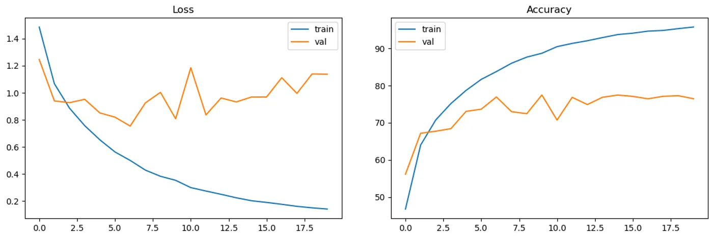
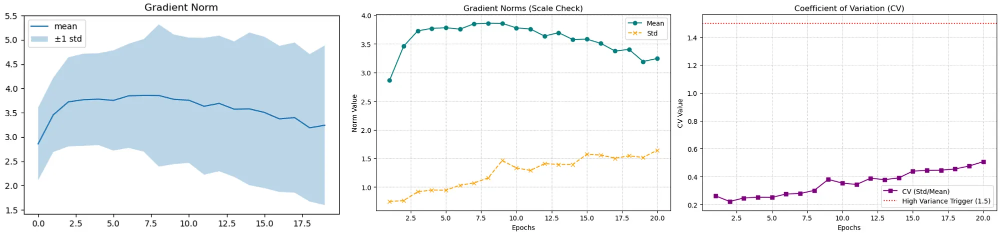
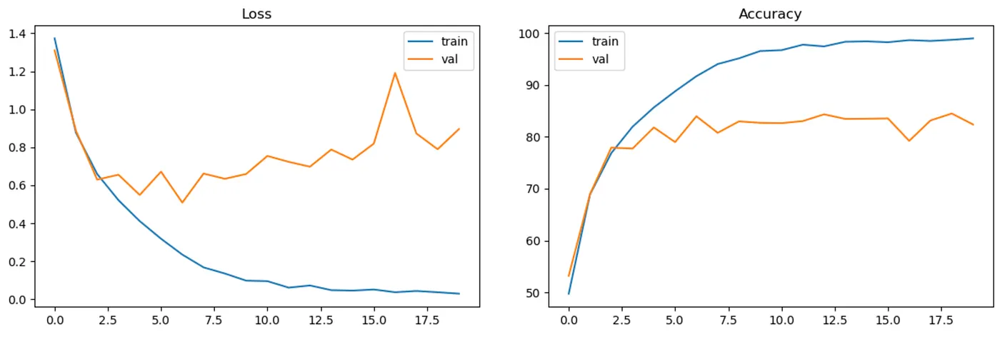
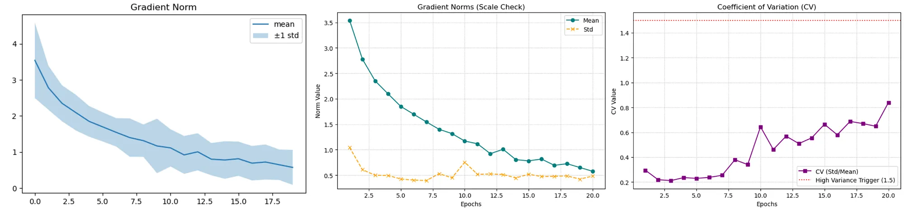
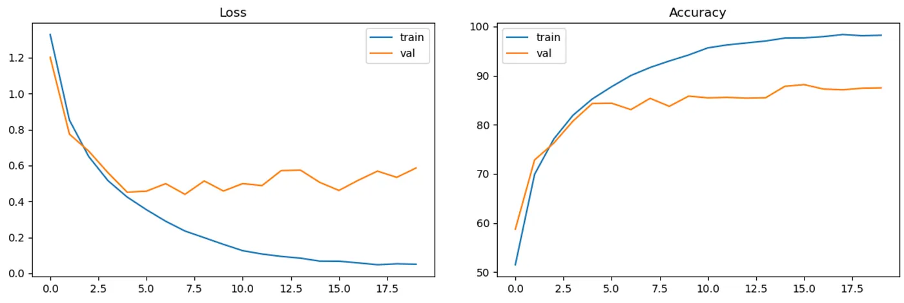
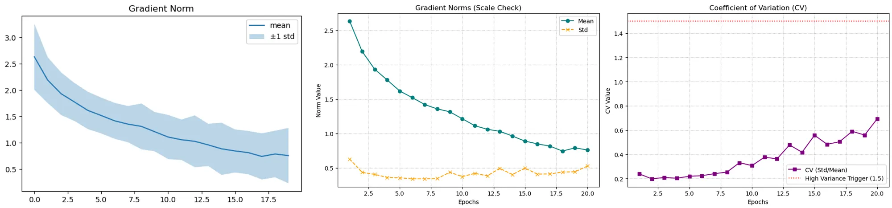
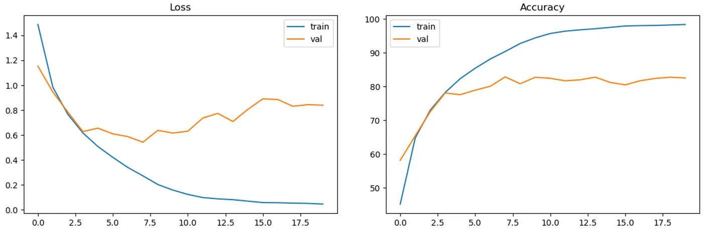
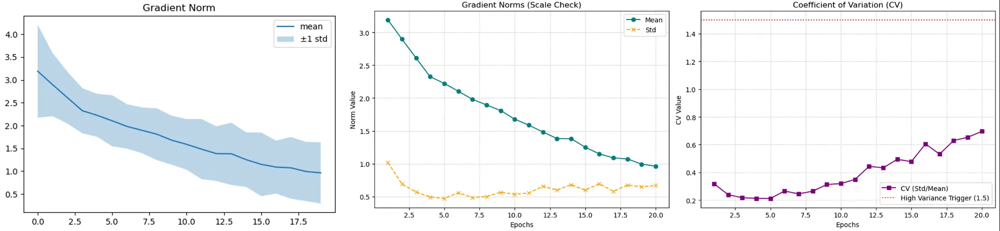

## 📊 Evaluation Results: 20-Epoch CIFAR-10 Sprint

Read complete article on 

This benchmark isolates **initial convergence speed**, **gradient flow health**, and **parameter efficiency** by heavily constraining the training schedule to just 20 epochs. Rather than measuring ultimate representational capacity (which requires 150+ epochs), this sprint reveals how effectively each architecture's wiring routes loss gradients back to early layers.

### 🏆 Summary Matrix

| Architecture | Accuracy (20 Ep.) | Architectural Paradigm | Gradient Flow Mechanics | Sprint Verdict |
| :--- | :---: | :--- | :--- | :--- |
| **Vanilla CNN** | 78% | Sequential Stacking | Suffers from vanishing signals | Slowest warm-up; throttled by sequential bottleneck. |
| **DLA** | 82% | Feature Aggregation (Trees) | Learned mixing via $1 \times 1$ Roots | High potential, but aggregation nodes require longer optimization. |
| **ResNet-18** | 84% | Residual Learning ($+$) | Parameter-free identity shortcuts | Rapid convergence; cleanly sidesteps degradation. |
| **DenseNet-121** | **88%** | Feature Reuse (`concat`) | Implicit deep supervision | **Champion.** Direct access to gradients ensures explosive early learning. |

---

### 1. Vanilla CNN (Baseline)
**Accuracy: 78%**

  
  

**Architectural Insight & Gradient Health:**
The plain CNN processes features in a strictly sequential, unreferenced pipeline. As information and gradients pass through many layers, they naturally begin to "wash out" by the time they reach the opposite end of the network. Without explicit architectural bypasses, the solver struggles to aggressively optimize early-layer weights, resulting in the slowest convergence speed of the group and highest training error. 

---

### 2. ResNet-18 (Residual Learning)
**Accuracy: 84%**

  
  

**Architectural Insight & Gradient Health:**
ResNet fundamentally alters the learning objective by using parameter-free identity shortcuts to cast layers as learning residual functions ($F(x) + x$). This provides a clean, unobstructed highway for backward-propagating gradients, entirely bypassing non-linear transformations. Because the optimal function is often closer to an identity mapping than a zero mapping, this architecture acts as a pre-conditioner. The gradient health is significantly stabilized compared to the plain CNN, enabling rapid early learning and completely sidestepping the degradation problem. 

---

### 3. DenseNet-121 (Densely Connected)
**Accuracy: 88% — *Sprint Winner***

  
  

**Architectural Insight & Gradient Health:**
DenseNet dominates the short-training regime through aggressive feature reuse, connecting each layer to every other layer via concatenation. From a gradient perspective, this topology acts as **implicit deep supervision**. Because early layers are directly wired to the final transition layers and the classifier, they receive unadulterated feedback from the loss function from epoch 1. This "all-to-all" gradient bypass eliminates optimization bottlenecks, yielding the highest parameter efficiency and the fastest, most stable convergence in our evaluation.

---

### 4. DLA (Deep Layer Aggregation)
**Accuracy: 82%**

  
  

**Architectural Insight & Gradient Health:**
While DLA is arguably the most sophisticated architecture—unifying spatial fusion via Iterative Deep Aggregation (IDA) and semantic fusion via Hierarchical Deep Aggregation (HDA)—it underperforms DenseNet and ResNet *specifically* in this 20-epoch sprint. Unlike DenseNet's raw concatenation or ResNet's simple addition, DLA uses dedicated **Aggregation Nodes** (Root nodes) equipped with $1 \times 1$ convolutions to actively mix and compress feature hierarchies. 

The gradient flow must navigate these learned mixing weights. Before the network can extract optimal features, it must first learn *how* to combine them. These $1 \times 1$ nodes act as initial gradient bottlenecks. While DLA achieves immense parameter efficiency and state-of-the-art representation in the long run, its complex fractal tree structures demand a standard, full-length training schedule to properly optimize.
