Understanding Modern CNN Design: Comparing CNN, ResNet, DenseNet, and DLA
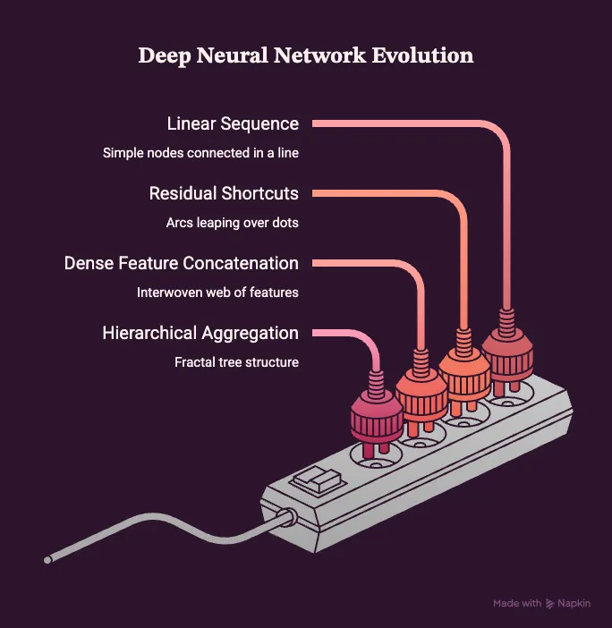
CNNs have been the strongest pillars of Computer Vision since its inception. Not only were they a profound concept when they were introduced against the plain ANNs which used to memorize the visual data, CNN and their architectural evolution have been continuously raising the bar for what's expected of Computer Vision.
Why bother with CNNs when we now have Vision Transformers?
Believing the hype that "CNNs are dead and ViTs are the new thing" is the easiest way to broadcast that you don't actually deploy models in the real world. While Transformers rule NLP, CNNs are aggressively winning back computer vision. Look at Meta's ConvNeXt: a pure CNN that modernized traditional design to match or beat flagship Swin Transformers on ImageNet. Today, ConvNeXt, EfficientNetV2, and DLA remain production backbones because ViTs are simply too heavy, data-hungry, and slow for actual hardware.
What architectures are we going to explore?
We will start by the very basic CNN (referred to here as "Vanilla" CNN) and set its performance as the baseline followed up by ResNet, DenseNet and DLA. This line up which I have selected is a great depiction of the "evolution" of CNN architecture over time. It is my duty to make you realize the "why" of every change, of every architectural decision which was made in a new design. Most reports obsess over final accuracy, but this one focuses squarely on the training process itself. Think of it like "it's about the journey, not the destination" - watching a model actually learn reveals way more diagnostic value and deep insight than a solitary final score. Pay close attention to how things evolve. And we will use this knowledge to further justify the performances across loss, accuracy, overfitting, gradients and stability.
1. Vanilla CNN
The classic plain CNN features 3 convolutional layers each followed by Max Pooling and Batch normalization. We use the pytorch's max_pool2d() function and BatchNorm2d class for this. The primary thing to note is that this architecture is completely Sequential. Each block is followed by another in a straight pipeline as demonstrated below:

Because its a rather small architecture the number of trainable parameters is just 651,210.
Evaluation:
Best validation Accuracy: 77.47%

Clearly, the model is overfitting. At and after 3–4 epochs only, the validation loss stopped reducing, complementarily, the accuracy also plateaued.
Next we look at gradient norms (fancy word for just the euclidean distance of gradient vectors) and the Coefficient of Variation (CV):
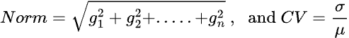

The values of gradient norm are themselves consistent, nothing abnormal. But when you look at the diverging standard deviation, you realize that different batches give different sized of updates to the model. In other words, model has not learned features which are universal or transferrable to any other image than which it is currently looking at. The low values of CV also emphasize no abnormality like exploding gradients etc.
We have clearly hit a road block here. There is no significant anomaly in the training proces, the gradient norms and training accuracy prove it, this clearly means even adding more layers might give you a 0.5–1% gain , but the same issue will still obstruct the performance.
2. ResNet
As I said , and as anyone would do when a model shows undesired mediocre performance, people stacked up more and more layers onto the vanilla CNN, 10..20….40 or even more and hoped for a miracle, some might have gotten a nominal 1–2% jump roughly but that was it. Then people sat down and analyzed the learning process of model itself and they found out the mole , The Degradation Problem.
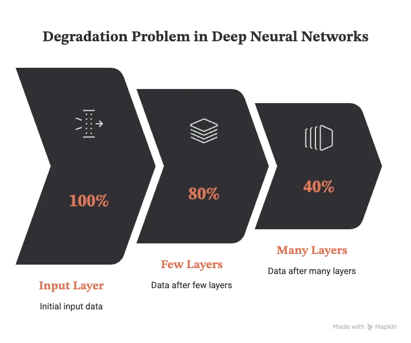
One single layer makes nominal transformations to an input, but when such changes aggregate over 30, 40 or 50 layers, the processed data begins to loose crucial information. To fight this, Kaiming He et al. (2015) introduces "Residual learning".
The Core Idea:
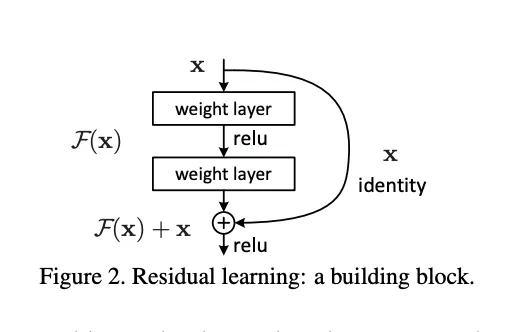
Assume the actual underlying functiong to learn is H(x), instead of directly learning H(x) we will have the layers learn the residual (output-input) i.e. the residual function is defined as F(x) = H(x)-x and hence the underlying fucntion become H(x) = F(x) + x. So now the layers learn this residual function F(x) which experimentally turned out to be much easier for them.
Why so? 2 reasons:
Easier zero mapping: In deeper networks a lot of layers needed to pass the input as it is so its penetrated the further layers and hence they needed to do an identity mapping i.e. Y=I* X. Normal cnn layers struggled with creating such mappings. But in residual mapping, if output=input this means H(x)=x and hence F(x) = 0 i.e. model only needed to push the weights to zero which was much easier.
Unobstrcuted gradient flow: Skip connections act like express lanes. Gradients travel back directly through this highway without getting lost, blocked, or altered by the heavy traffic of the deeper layer transformations.

To formally write, every output y is a sum of residuals from previous layers F(x,Wi) , where W represent weights of previous layers , and the input x:
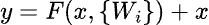
I present below a very basic implementation of residual logic:
```python
conv1 = nn.Conv2d(in_channels=64, out_channels=64, kernel_size=3, stride=1, padding=1, bias=False)
conv2 = nn.Conv2d(in_channels=64, out_channels=64, kernel_size=3, stride=1, padding=1, bias=False)
x = torch.randn(1, 64, 32, 32)
print(f"Input Shape: {x.shape}")
out = F.relu(conv1(x))
out = conv2(x)
print(f"Shape of F(x) : {out.shape} and Shape of x: {x.shape}")
out += x
out = F.relu(out)
print(f"Shape of final output: {out.shape}")
# All shapes are same here!
#### OUTPUT ####
Input Shape: torch.Size([1, 64, 32, 32])
Shape of F(x) : torch.Size([1, 64, 32, 32]) and Shape of x: torch.Size([1, 64, 32, 32])
Shape of final output: torch.Size([1, 64, 32, 32])
```

There is a small nuance here which we need to keep in mind, when adding during the shortcut , the shape of residual and input must match, i.e. if there is no downsampling (stride=1) then they will surely match, but if the layers do any downsampling (stride>1) then the sized will mismatch and we will need to project the input x to match the size of residual F(x). To demonstrate this:
```python
# Stride=2 halves the image size to 16x16. Channels increase to 128.
conv1_down = nn.Conv2d(64, 128, kernel_size=3, stride=2, padding=1, bias=False)
conv2_down = nn.Conv2d(128, 128, kernel_size=3, stride=1, padding=1, bias=False)

print(f"Input Shape : {x.shape}")

out = F.relu(conv1_down(x))
out = conv2_down(out)

print(f"Shape after convolutions and spatial change: {out.shape}")

try:
    out = out + x
except RuntimeError as e:
    print(f"ERROR: {e}")
############ OUTPUT ############
Input Shape : torch.Size([1, 64, 32, 32])
Shape after convolutions and spatial change: torch.Size([1, 128, 16, 16])
ERROR: The size of tensor a (16) must match the size of tensor b (32) at non-singleton dimension 3
```
How do we fix this? We use a 1x1 Convolution on the input x to tone it down to match the shape of F(x) whenever there's a mismatch :
```python
# F(x) path
print(f"Shape of Input (x): {x.shape}")
out = F.relu(conv1_down(x)) 
out = conv2_down(out)       
print(f"Shape of residual F(x): {out.shape}")
# W_s(x) path: 1x1 conv to match dimensions
shortcut = nn.Conv2d(in_channels=64, out_channels=128, kernel_size=1, stride=2, bias=False)

# Now addition works!
x_projected = shortcut(x)   
print(f"Shape of input (x) after 1x1 projection: {x_projected.shape}")
out = out + x_projected 
print("YAYY THEY MATCH :)") if x_projected.shape == out.shape else print("Shapes don't match")

##### OUTPUT #####
Shape of Input (x): torch.Size([1, 64, 32, 32])
Shape of residual F(x): torch.Size([1, 128, 16, 16])
Shape of input (x) after 1x1 projection: torch.Size([1, 128, 16, 16])
YAYY THEY MATCH :)
```
With this background we present the classic Resnet18 model here which used 4 macro blocks, each made of sever such skip connection blocks :
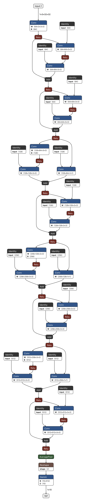

ResNet18While this might looks humongous, we only need to focus on 2 specific nuances. Notice in the very beginning, from the first ReLU , 2 branches protrude , one goes through convolution 3x3 and the other directly to "Add" , this is the identity shortcut. Straight away sending input x to add it to F(x) . Now notice the 3rd loop block , here in the standard path , there was downsampling, the dimension went from 32x32 to 16x16 and channels doubled from 64 to 128. This is the reason the other branch (identity) shortcut here has to introduce convolution of 1x1 to match the size of F(x) coming out of other branch.
Since its bigger much than the basic CNN, the total number of trainable parameters here are 11,173,962. A sharp jump.
Evaluation:
Best Validation Accuracy: 84.49%

Our first major breakthrough! The accuracy jumped from 77 to 84! While the overfitting signs are still present, we can say the extent is not as much as was in the case of vanilla CNN. Let's look at the training process and gradients:

The fluctuations of gradients have dropped significantly, we can say the model has began to learn generalized patterns which are applicable across different batches. The Coefficient of Variation is still very small and indicates healthy variation.
ResNet's residual connections clearly solved the degradation problem - the gradients are healthier, the model generalizes better. But look closer: a skip connection in ResNet only reaches back one block. The deeper layers still have pretty limited access to early low-level features. You fixed the highway, but you're still only glancing one exit behind you. So researchers asked -What if we just connected everything to everything?
3. DenseNet
That question is exactly what Huang et al. ran with in 2017. The idea is almost stubbornly simple: every layer gets the feature maps of all previous layers as input, not just its immediate neighbor. Where ResNet adds the skip to the output, DenseNet concatenates - so no information ever gets lost or overwritten, it just keeps piling on. The authors called this feature reuse, and it changes the game for even the very earliest layers in the network.
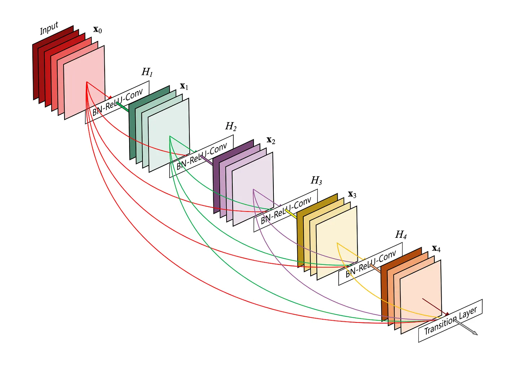
The phrase "keeps piling on" might give the feeling of "burden" or "inefficiency" to you at first read, and you would be right, that is something to which this paper provides solution to, and no surprise a similar one we saw earlier. We will discuss that later but let's first see a very basic forward pass of densenet model:
```python
class BasicDenseLayer(nn.Module):
    def __init__(self, in_planes, growth_rate):
        super().__init__()
        # Pre activation: BN --> ReLU --> Conv
        self.bn = nn.BatchNorm2d(in_planes)
        self.conv = nn.Conv2d(in_planes, growth_rate, kernel_size=3, padding=1,bias=False)

    def forward(self,x):
        new_features = self.conv(F.relu(self.bn(x)))
        print(f"Shape before concatenation: {new_features.shape}")
        out = torch.cat([new_features,x],dim=1)
        print(
            f"Channel growth: Existing {x.shape[1]} channels + "
            f"New {new_features.shape[1]} channels = "
            f"{out.shape[1]} total channels"
        )
        print(f"Shape of output: {out.shape}")
        return out 
    
x = torch.randn(1,64,32,32)
layer = BasicDenseLayer(64,12)
out = layer(x)

### OUTPUT ###
Shape before concatenation: torch.Size([1, 12, 32, 32])
Channel growth: Existing 64 channels + New 12 channels = 76 total channels
Shape of output: torch.Size([1, 76, 32, 32])
```
Few things to point out, the DenseNet use "Pre-activation" i.e. it does Batch Normalization and ReLU filtering before the actual convolution so that the original, distinct feature maps from all preceding layers are preserved and cleanly concatenated as inputs, allowing the network to generate uniquely normalized copies of each feature map rather than destroying them.
growth_rate here is just fancy word for "new channels" introduced during convolution. As you can see the original input channels were 64 and setting growth rate=12 just stacked that many channels on top of input and we get 12+64 = 76 channels in the output.
Similar to ResNets, here as well we will use a 1x1 convolution to control the output dimensions so that i doesn't grow uncontrollably. The idea is that the first convolution will reduce the incoming "big" number of channels to something reasonable (4 * growth_rate) and then further process it :
```python
class Bottleneck(nn.Module):
    def __init__(self, in_planes, growth_rate):
        super().__init__()

        # 1. Bottleneck to shrink channels
        self.bn1 = nn.BatchNorm2d(in_planes)
        # 1x1 conv reduces arbitrary in_planes to 4*growth_rate
        self.conv1 = nn.Conv2d(in_planes, 4*growth_rate, kernel_size=1,bias=False)

        # 2. Process spatial information
        self.bn2 = nn.BatchNorm2d(4*growth_rate)
        self.conv2 = nn.Conv2d(4*growth_rate, growth_rate, kernel_size=3, padding=1,bias=False)

    def forward(self, x):

        print(f"[Input Features]            : {x.shape}")

        # 1×1 Bottleneck Compression
        out = self.conv1(F.relu(self.bn1(x)))
        print(f"[After 1×1 Bottleneck]      : {out.shape}")

        # 3×3 Spatial Processing
        out = self.conv2(F.relu(self.bn2(out)))
        print(f"[New Features Generated]    : {out.shape}")

        # Dense Concatenation
        old_channels = x.shape[1]
        new_channels = out.shape[1]

        out = torch.cat([out, x], dim=1)

        print(
            f"[Dense Concatenation]       : "
            f"{new_channels} + {old_channels} = {out.shape[1]} channels"
        )

        print(f"[Final Output]              : {out.shape}")

        return out
x_deep = torch.randn(1,1664, 32,32) # intentionally chose a big channel count
layer = Bottleneck(in_planes=1664,growth_rate=32)
out_deep = layer(x_deep)
#### OUTPUT ####
[Input Features]            : torch.Size([1, 1664, 32, 32])
[After 1×1 Bottleneck]      : torch.Size([1, 128, 32, 32])
[New Features Generated]    : torch.Size([1, 32, 32, 32])
[Dense Concatenation]       : 32 + 1664 = 1696 channels
[Final Output]              : torch.Size([1, 1696, 32, 32])
```

But you might ask "We can't keep stacking as well either? Can we?" and you would be right! We can't. That's why we will divide the network into multiple densely connected dense blocks. Within a block, the spatial dimensions (e.g., 32×32) shall remain frozen. And between the blocks, we place a Transition Layer to handle downsampling. The transition block defines a θ parameter where 0<θ≤1 to downsample the incoming channels hoard. Here θ is denoted with reduction:
```python
import torch
import torch.nn as nn
import torch.nn.functional as F
class Transition(nn.Module):
    def __init__(self, in_planes, out_planes):
        super(Transition, self).__init__()
        # Pre-activation
        self.bn = nn.BatchNorm2d(in_planes)
        # 1x1 conv to compress channels (theta)
        self.conv = nn.Conv2d(in_planes, out_planes, kernel_size=1, bias=False)

    def forward(self, x):
        out = self.conv(F.relu(self.bn(x)))
        # 2x2 average pooling to halve spatial dimensions
        out = F.avg_pool2d(out, 2)
        return out

# Let's pretend Dense Block 1 just finished. 
# It hoarded 256 channels of knowledge on a 32x32 image.
block1_output = torch.randn(1, 256, 32, 32)
in_planes = 256

# We apply a compression factor (theta / reduction) of 0.5
reduction = 0.5
out_planes = int(in_planes * reduction) # 256 * 0.5 = 128 channels

# Initialize the transition layer
trans_layer = Transition(in_planes, out_planes)

out = trans_layer(block1_output)
```

Now that we have seen the stacking mechanism and the parameter which controls is, we are ready to move the actual architecture of densenet. Just a quick note, I implemented and tested DenseNet121 and its true architectur is too big to visualize with any tool, so here I present a trimmed down version of a densenet (and its still pretty big to fit here) to make things easier:
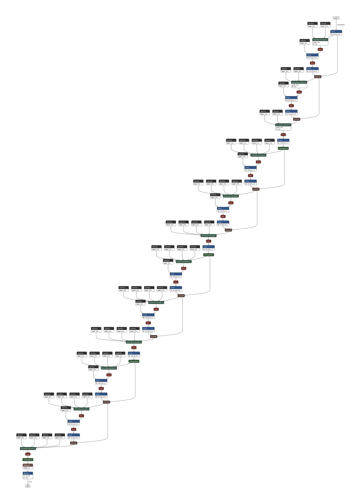
Clearly, there are 4 blocks of 2 convolutional layers each and between each of those 4 blocks is a transition layer which handles channels downsampling and spatial mismatch. Let's evaluate out DenseNet (the evaluation is on complete DenseNet121) and see how far we have come:
Evaluation:
Best Validation Accuracy: 88.15%

And there you go! Another 4% jump from out last ResNet attempt! Clearly the idea works. We connected everything to everything and that increased the feature reused by our model, made it more generalizing across batches. A 88.15% accuracy is definitely something to celebrate , now let's look at the gradients:

Here we see a very slight increase in gradient standard deviation compared to ResNet, but its small magnitude could easily be attributed to chance-level noise rather than any structural instability. The CV and gradient norms themselves remain well within healthy range throughout training.
DenseNet is the clearest proof yet that the way you connect layers matters just as much as how many you stack. No new activation function, no exotic optimizer trick - just a smarter wiring diagram. But here's what's worth sitting with: DenseNet connects everything to everything within a flat sequence. Every layer still lives on the same level. What if the architecture itself had hierarchy - where features at different scales and depths were aggregated in a structured, tree-like manner rather than just concatenated in a line? That's the design philosophy DLA was built on.
4. DLA (Deep Layer Aggregation)
Yu and Koltun answered that in 2018 with Deep Layer Aggregation. The argument was simple but sharp: concatenating everything is powerful, but it's unstructured. DenseNet treats all previous layers as equally important - everything gets dumped into one big pile. DLA instead proposes that features should be merged hierarchically - shallow features with shallow, deep features with deep, and only then across scales. Think of it less like a group chat where everyone talks to everyone, and more like a well-organized meeting where related people first align internally before the whole room comes together. The result is a network that doesn't just reuse features - it understands which features belong together before merging them.
Unlike ResNet , which used simple + operator to merge output and input and DenseNet , which used torch.cat operator, DLA uses dedicated "Aggregation" nodes to aggregate the outputs from different layers at different stages. Mathematically:
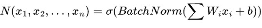
How does this look like in code?
```python
class Root(nn.Module):
    def __init__(self,in_channels, out_channels, kernel_size=1):
        super(Root, self).__init__()
        self.conv = nn.Conv2d(
            in_channels, out_channels, kernel_size, stride=1,padding=(kernel_size-1)//2,bias=False
        )
        self.bn = nn.BatchNorm2d(out_channels)

    def forward(self,xs):
        # xs is a list of tensors
        x = torch.cat(xs,1)
        out = F.relu(self.bn(self.conv(x)))
        return out
    
# Assume we have 3 different features branches arriving at this node
# Each has 32 channels and a 16x16 spatial size
branch_1 = torch.randn(1,32,16,16)
branch_2 = torch.randn(1,32,16,16)
branch_3 = torch.randn(1,32,16,16)

root_node = Root(in_channels=96,out_channels=64)
# Total incoming = 32 + 32 + 32 = 96
output = root_node([branch_1,branch_2,branch_3])

print(f"Output shape after Root Fusion: {output.shape}")

### OUTPUT ###
Output shape after Root Fusion: torch.Size([1, 64, 16, 16])
```

But this again was a perfect example, what if there's spatial mismatch again ? Afterall the entire point of a tree structure is that layers keep merging the output which means at time network's shallow , high resolution stages need to be merged to deep, low resolution images. The answer is the 2 hierarchies we introduced, IDA and HDA.
Let's look at IDA (Iterative Deep Aggregation) first:
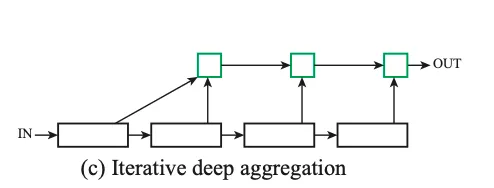
IDAIDA progressively combines and improves feature representations. It starts with the shallowest feature map, refines it, and then gradually merges it with deeper, larger-scale feature maps one stage at a time. Its mathematical formulation is also therefore recursive: (N = aggregation node)
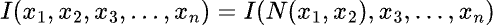
Lets look at a toy example in code:
```python
# Let's say we have 3 stages in a network with decreasing resolutions
stage1_feat = torch.randn(1, 32, 32, 32) # Scale 1 (Shallow)
stage2_feat = torch.randn(1, 64, 16, 16) # Scale 2
stage3_feat = torch.randn(1, 128, 8, 8)  # Scale 3 (Deep)

# Aggregation Node N for Stage 1 + Stage 2
# We need to downsample Stage 1 (32x32 -> 16x16) to mix it with Stage 2
downsample_1to2 = nn.MaxPool2d(kernel_size=2, stride=2)
# Channels: Stage 1 (32) + Stage 2 (64) = 96. Output = 64
N_1_2 = Root(in_channels=96, out_channels=64)

# Aggregation Node N for (Stage 1+2) + Stage 3
downsample_2to3 = nn.MaxPool2d(kernel_size=2, stride=2)
# Channels: Mixed (64) + Stage 3 (128) = 192. Output = 128
N_1_2_3 = Root(in_channels=192, out_channels=128)

# --- The IDA Forward Pass ---
# Step A: N(x1, x2)
x1_down = downsample_1to2(stage1_feat) # Shape: [16-18]
mixed_1_2 = N_1_2([x1_down, stage2_feat]) # Shape: [16, 18, 19]

# Step B: I(N(x1, x2), x3)
mixed_1_2_down = downsample_2to3(mixed_1_2) # Shape: [16, 19, 20]
final_ida_out = N_1_2_3([mixed_1_2_down, stage3_feat]) # Shape: [16, 20, 21]

print(f"Final IDA shape: {final_ida_out.shape}")
### OUTPUT ###
Final IDA shape: torch.Size([1, 128, 8, 8])
```

Notice the brilliance here: stage1_feat passes through two aggregation nodes (N_1_2 and N_1_2_3), meaning the shallowest feature is processed and refined the most. This is the exact opposite of standard skip connections.
IDAs are good for spatial fusion. And for semantic features fusion from different stages, we make use of HDAs (Hierarchical Deep Aggregation). They arrange merging blocks in a tree like structure to better combine the features across the entire feature hierarchy space. Let's look at a toy example to illustrate merging to 2 different level of feature by a tree structure node:
```python
class ToyTreeLevel1(nn.Module):
    def __init__(self,block,channels):
        super().__init__()
        # Two consecutive processing blocks
        self.left_node = block(in_planes=channels, planes = channels)
        self.right_node = block(in_planes=channels, planes = channels)

        # A Root node to aggregate the two blocks
        # It receives 2 branches (so 2 * channels) and compress back to 'channels'ArithmeticError
        self.root = Root(in_channels=2*channels, out_channels=channels)

    def forward(self,x):
        # 1. First block processes the input 
        print(f"Shape of Original input x: {x.shape}")
        x1 = self.left_node(x)
        print(f"Shape of left node output left_node(x): {x1.shape}")

        # 2. Second block processess the output of the first
        x2 = self.right_node(x1)
        print(f"Shape of right node output right_node(left_node(x)): {x2.shape}")

        # 3. The root node aggregates BOTH stages of feature hierarchy
        out = self.root([x1,x2])
        print(f"Shape of Root node's output: {out.shape}")
        return out 
# Input : 32 channels, 16x16 spatial size
x = torch.randn(1,32,16,16)
tree_lvl1 = ToyTreeLevel1(BasicBlock, channels=32)
print(f"Output shape of Level 1 Tree: {tree_lvl1(x).shape}")

### OUTPUT ###
Shape of Original input x: torch.Size([1, 32, 16, 16])
Shape of left node output left_node(x): torch.Size([1, 32, 16, 16])
Shape of right node output right_node(left_node(x)): torch.Size([1, 32, 16, 16])
Shape of Root node's output: torch.Size([1, 32, 16, 16])
Output shape of Level 1 Tree: torch.Size([1, 32, 16, 16])
```

What about deeper trees? Won't that get complicated?
Yes, if done in naive fashion. The naive fractal tree structure like below has several limitations:
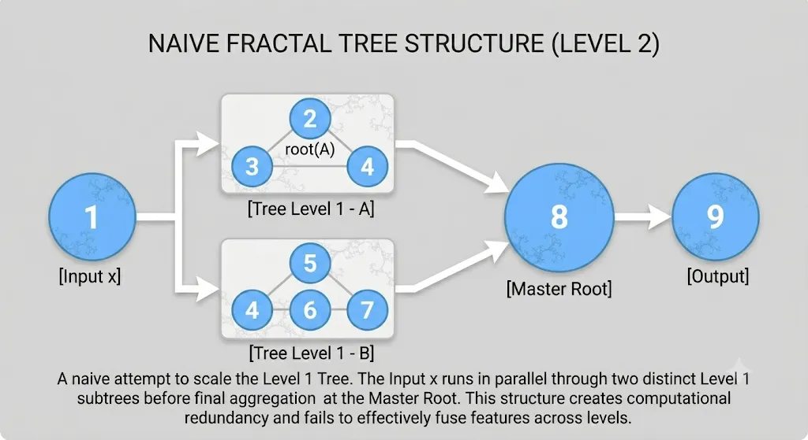
Redundant Computation: If Tree A and Tree B run in parallel on the same input , they extract redundant features. If they run sequentially , Tree B only receives the finalized output of Tree A, but not its intermediate rich sub features.
Intermediate nodes are barriers: Internal roots act as filters. In a naive tree, early detailed features get bundled and summarized by local manager nodes before moving up. By the time this summary reaches the top, the raw details are watered down.Furthermore, feedback (gradients) must travel back through these same middlemen, slowing down and weakening the learning process for early layers.

What's the solution?
Reentrant Aggregation
Instead of treating aggregation as a dead-end branch that only looks upward, the network loops the output of an aggregation node back down into the main backbone.Every new layer automatically inherits a fully synthesized history of everything that came before it, rather than just blindly processing the one isolated layer preceding it. Mind you this entire pipeline is actually kind of sequentially dependent, the output of subtree A is looped back (aggregated) to subtree B for further processing so the subtree B has full history and context.
The Tree class with such recursive aggregation:
```python
class Tree(nn.Module):
    def __init__(self, block, in_channels, out_channels, level=1,stride = 1):
        super().__init__()
        self.level = level 

        # --- BASE CASE (Level 1) ---
        if level == 1:
            self.root = Root(2*out_channels , out_channels)
            self.left_node = block(in_channels,out_channels,stride=stride)
            self.right_node = block(out_channels, out_channels, stride=1)

        # --- RECURSIVE CASE (Level>1) ---
        else:
            # Root receives (level+2) branches due to reentrant connections
            self.root = Root((level+2) * out_channels, out_channels)

            for i in reversed(range(1,level)):
                subtree = Tree (block , in_channels, out_channels,
                                level=i, stride=stride)
                self.__setattr__('level_%d'%i,subtree)
            
            self.prev_root = block(in_channels, out_channels, stride = stride)
            self.left_node = block(out_channels, out_channels, stride=1)
            self.right_node = block(out_channels,out_channels, stride=1)

    def forward(self,x):
        # 1. The Reentrant Connection!
        # If we are deep in the tree, process the input through prev_root first.
        xs = [self.prev_root(x)] if self.level>1 else []

        # 2. Pass through the subtrees, hoarding the outputs in our 'xs' list
        for i in reversed(range(1, self.level)):
            level_i = self.__getattr__('level_%d' % i)
            x = level_i(x)
            xs.append(x)

        # 3. Pass through the final left and right blocks
        x = self.left_node(x)
        xs.append(x)
        x = self.right_node(x)
        xs.append(x)

        # 4. The Aggregation Node (Root) fuses the entire hierarchy
        out = self.root(x)
        return out 
```

The final macro architecture of DLA:
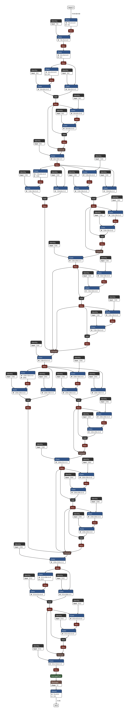
This is the first time i would ask you to actually understand it from the code rather than the visual architecture as the recursions make it more complicated to visualize:
```python
import torch
import torch.nn as nn
import torch.nn.functional as F

# --- Module 1 components ---
class Root(nn.Module):
    def __init__(self, in_channels, out_channels):
        super(Root, self).__init__()
        self.conv = nn.Conv2d(in_channels, out_channels, kernel_size=1, stride=1, bias=False)
        self.bn = nn.BatchNorm2d(out_channels)
        self.relu = nn.ReLU(inplace=True)

    def forward(self, xs):
        x = torch.cat(xs, dim=1)
        out = self.relu(self.bn(self.conv(x)))
        return out

class BasicBlock(nn.Module):
    def __init__(self, in_planes, planes, stride=1):
        super(BasicBlock, self).__init__()
        self.conv1 = nn.Conv2d(in_planes, planes, kernel_size=3, stride=stride, padding=1, bias=False)
        self.bn1 = nn.BatchNorm2d(planes)
        self.relu = nn.ReLU(inplace=True)
        self.conv2 = nn.Conv2d(planes, planes, kernel_size=3, stride=1, padding=1, bias=False)
        self.bn2 = nn.BatchNorm2d(planes)
        
        self.shortcut = nn.Sequential()
        if stride != 1 or in_planes != planes:
            self.shortcut = nn.Sequential(
                nn.Conv2d(in_planes, planes, kernel_size=1, stride=stride, bias=False),
                nn.BatchNorm2d(planes)
            )

    def forward(self, x):
        out = self.relu(self.bn1(self.conv1(x)))
        out = self.bn2(self.conv2(out))
        out += self.shortcut(x)
        out = self.relu(out)
        return out

# --- Module 2 components ---
class Tree(nn.Module):
    def __init__(self, block, in_channels, out_channels, level=1, stride=1):
        super(Tree, self).__init__()
        self.level = level
        
        # --- BASE CASE (Level 1) ---
        if level == 1:
            self.root = Root(2*out_channels, out_channels)
            self.left_node = block(in_channels, out_channels, stride=stride)
            self.right_node = block(out_channels, out_channels, stride=1)
            
        # --- RECURSIVE CASE (Level > 1) ---
        else:
            # Root receives (level + 2) branches due to the reentrant connections
            self.root = Root((level+2)*out_channels, out_channels)
            
            # Recursively build smaller trees
            for i in reversed(range(1, level)):
                subtree = Tree(block, in_channels, out_channels,
                               level=i, stride=stride)
                self.__setattr__('level_%d' % i, subtree)
                
            self.prev_root = block(in_channels, out_channels, stride=stride)
            self.left_node = block(out_channels, out_channels, stride=1)
            self.right_node = block(out_channels, out_channels, stride=1)

    def forward(self, x):
        # 1. The Reentrant Connection!
        # If we are deep in the tree, process the input through prev_root first.
        xs = [self.prev_root(x)] if self.level > 1 else []
        
        # 2. Pass through the subtrees, hoarding the outputs in our `xs` list
        for i in reversed(range(1, self.level)):
            level_i = self.__getattr__('level_%d' % i)
            x = level_i(x)
            xs.append(x)
            
        # 3. Pass through the final left and right blocks
        x = self.left_node(x)
        xs.append(x)
        x = self.right_node(x)
        xs.append(x)
        
        # 4. The Aggregation Node (Root) fuses the entire hierarchy
        out = self.root(xs)
        return out

# --- Complete DLA Architecture ---
class DLA(nn.Module):
    def __init__(self, block=BasicBlock, num_classes=10):
        super(DLA, self).__init__()
        # --- STAGE 1: Keep resolution, extract initial features ---
        self.base = nn.Sequential(
            nn.Conv2d(3, 16, kernel_size=3, stride=1, padding=1, bias=False),
            nn.BatchNorm2d(16),
            nn.ReLU(True)
        )
        self.layer1 = nn.Sequential(
            nn.Conv2d(16, 16, kernel_size=3, stride=1, padding=1, bias=False),
            nn.BatchNorm2d(16),
            nn.ReLU(True)
        )
        
        # --- STAGE 2: Increase channels to 32 ---
        self.layer2 = nn.Sequential(
            nn.Conv2d(16, 32, kernel_size=3, stride=1, padding=1, bias=False),
            nn.BatchNorm2d(32),
            nn.ReLU(True)
        )
        
        # --- STAGES 3 to 6: Aggregation Trees ---
        self.layer3 = Tree(block,  32,  64, level=1, stride=1) # Stage 3
        self.layer4 = Tree(block,  64, 128, level=2, stride=2) # Stage 4
        self.layer5 = Tree(block, 128, 256, level=2, stride=2) # Stage 5
        self.layer6 = Tree(block, 256, 512, level=1, stride=2) # Stage 6
        
        self.linear = nn.Linear(512, num_classes)

    def forward(self, x):
        out = self.base(x)
        out = self.layer1(out)
        out = self.layer2(out)
        out = self.layer3(out)
        out = self.layer4(out)
        out = self.layer5(out)
        out = self.layer6(out)
        out = F.avg_pool2d(out, 4)
        out = out.view(out.size(0), -1)
        out = self.linear(out)
        return out

if __name__ == "__main__":
    # Simulate a batch of 1 image with 3 channels (RGB) at 32x32 resolution
    x = torch.randn(1, 3, 32, 32)
    model = DLA(block=BasicBlock, num_classes=10)
    predictions = model(x)
    print(f"Final Output Shape: {predictions.shape}") # Expect: [1, 10]
```

It can be dissected in 3 steps:
Step 1: The Shallow Base (Stages 1 & 2): At the earliest layers, features consist of simple shapes, raw edges, and colors. Running a highly complex tree structure here is computationally wasteful. The network uses a simple, sequential setup to pre-process the image into 32 feature channels before handing it over to the deep aggregation mechanics.
Step 2: The Aggregation Stages (Stages 3 to 6): Next, the network transitions entirely to the Tree architecture. Across these stages, spatial resolution is halved (downsampled) while channel counts double.
The Role of IDA: Iterative Deep Aggregation (IDA) combines with HDA via reentrant connections (prev_root). When an output passes to a new stage, it immediately enters the current stage's hierarchical mixer, continuously merging features across different resolutions.
Why Tree Levels Vary: The authors adjust the tree depth based on feature complexity. Early on (Stage 3), features are too basic for massive trees. At the final stage (Stage 6), the feature map is tiny ($4 \times 4$), meaning a deep tree would be computationally expensive and prone to overfitting. The depth naturally bulges in the middle where it is needed most.

Step 3: Global Average Pooling (The Finale): Finally, a global average pooling layer compresses the spatial dimensions into a single $1 \times 1$ pixel vector before passing it to a linear classifier.
Let's now test our final contestant
Evaluation:
Best val acc : 82.89%

Too bad only 82%. But I will tell you why its not that surprising at all. The experiment here ran only for 20 epochs, and on CIFAR 10 with 40K images it is significantly small training time. I will explain the reason behind this in more detail but let's finish the evaluation by looking at the gradients:

The gradients are mostly normal , everything is , relatively speaking, withing the normal limits compared to other models.
Then what's the issue?
Gradient Flow and Convergence Speed: At only 20 epochs, the test becomes more of flow efficiency and initial convergence speed. Densenet uses direct concatenation , because every layer is direcly connected to the transition layers and final classifier , the loss function's gradients shoot directly back to the ealier layers without interference. Thats why the network learns incredibly fast. Whereas in HDA, features are concatenated and passed through 1x1 convoluiton to be mised and compressed. This means the gradients must pass through tese learned misxing weights to reach erlier layers. Before the network can learn good features, it must first learn how to mix them.At 20 epochs, these 1×1 aggregation nodes are likely still under-optimized.
Feature Reuse vs Feature Mixing: Explicitly separates new information from preserved information. By using a small growth rate (e.g., k=12), a layer only has to learn 12 new feature maps, while relying on the "collective knowledge" of all previous layers perfectly preserved via concatenation. This makes DenseNet exceptionally parameter-efficient and fast to train from scratch. While DLA also uses trees to presever feaatues, ite reentrant connections and root nodes actively fuse and compress feartures. DLA is highly parameter efficient in long run, but learning the oprimial compression of features requires longer training time.
DLA's IDA is specifically engineered to fuse spaial scales and reslutions (improving inference of "what and where). On high-resolution tasks, IDA shines by continuously rerouting shallow , high-res fearues into deeper, low-res features. However, on a 32x32 image , applying convolutions with stide of 2 shrings the spatial dimensions to 1x1 very quickly. The netwrok has almost no spatial heirechy to actually fuse.

To actually se DLA surpass other architectures, one must utilize full trainig duration, use higher image resolution and use it on tasks requiring precise spatial localisation combined with deep semantic understanding, such as semantic segmentation (e.g. Cityscapes) or Boundary detection.
Conclusion:
To conclude, in our 20-epoch CIFAR-10 sprint, the results perfectly highlight early network dynamics. Plain CNNs lagged at 78% due to gradient bottlenecks. ResNet-18 reached 84%, using parameter-free identity shortcuts to smooth early gradient flow. However, DenseNet-121 took the crown at 88%; its dense connections and feature concatenation provide implicit deep supervision, allowing instant gradient feedback for rapid early convergence. Finally, the highly advanced DLA scored 82%. While its Iterative and Hierarchical Deep Aggregation (IDA and HDA) trees are incredibly parameter-efficient, its learned aggregation nodes require much longer training schedules to properly optimize and fuse semantic and spatial features.